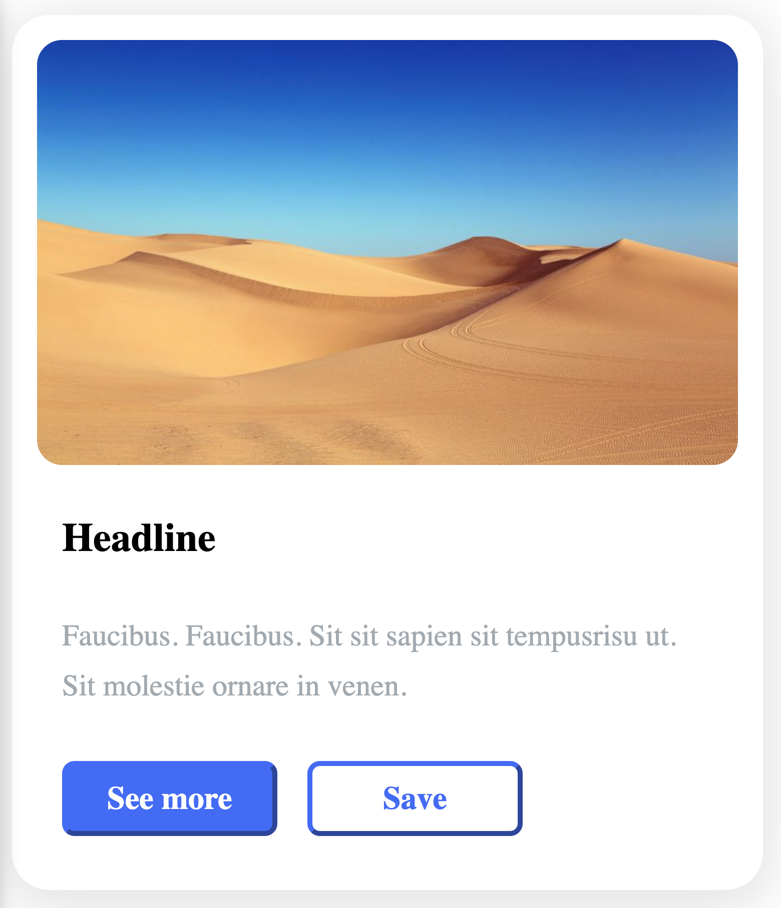
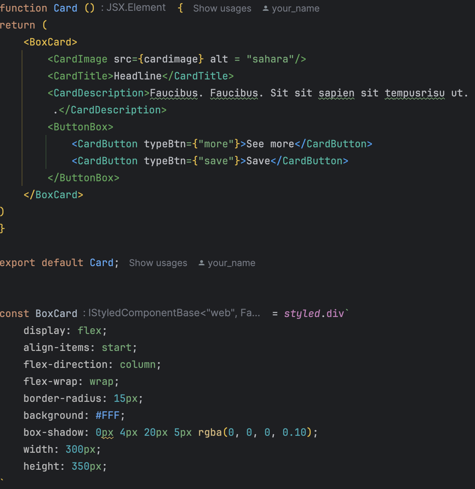

# Card Component Project

This project is a simple React application that demonstrates the use of styled-components for styling React components. The project structure is organized to maintain clarity and modularity.
<picture>
  <source media="(prefers-color-scheme: dark)" srcset="./src/assets/card.png">
  <source media="(prefers-color-scheme: light)" srcset="./src/assets/card.png">
  
</picture>


## Project Structure
```
card
│
├── node_modules
│
├── public
│
├── src
│ ├── assets
│ │ └── cardimage.jpeg
│ │
│ ├── components
│ │ ├── Styles
│ │ │ ├── GlobalStyles.tsx
│ │ │ ├── Theme.styled.tsx
│ │ │ └── Button.styled.tsx
│ │ │
│ │ ├── Card.tsx
│ │
│ ├── App.css
│ ├── App.test.tsx
│ ├── App.tsx
│ ├── index.tsx
│ ├── react-app-env.d.ts
│ ├── reportWebVitals.ts
│ ├── setupTests.ts
│
├── .gitignore
├── package.json
├── README.md
├── tsconfig.json
└── yarn.lock
```

## Getting Started

### Prerequisites

- Node.js
- Yarn or npm

### Installation

1. Clone the repository

2. Install the dependencies:
````
yarn install
# or
npm install
````

Running the Project
To start the development server, run:
````
yarn start
# or
npm start
````
Open http://localhost:3000 to view it in the browser.

## Advantages of Using styled-components

1. Scoped Styling:

Styled-components allow you to write CSS directly in your JavaScript files. This scoping ensures that styles are applied only to the component they are intended for, reducing the risk of style conflicts.

2. Dynamic Styling:

Styled-components support dynamic styling based on props, making it easy to change styles based on component state or props.

3. No Class Name Bugs:

Styled-components automatically generate unique class names for your styles, eliminating the possibility of class name collisions and simplifying the debugging process.

4. Easier Maintenance:

By co-locating styles with their components, styled-components promote better maintainability and readability. Changes to a component’s styles can be made directly within the component file.

5. Theming:

Styled-components support theming out of the box, allowing you to define a theme and apply consistent styles across your application.

6. No Separate CSS Files:

Since styled-components are written in JavaScript, there is no need to manage separate CSS or SCSS files. This can simplify the project structure and reduce the cognitive load for developers.

7. Enhanced Developer Experience:

Styled-components provide helpful warnings and errors during development, ensuring that common mistakes are caught early.

# Example

Below is an example of how a styled button is created and used in this project:
<picture>
  <source media="(prefers-color-scheme: dark)" srcset="./src/assets/2.png">
  <source media="(prefers-color-scheme: light)" srcset="./src/assets/2.png">
  
</picture>

# Conclusion
Using styled-components in this project has provided a streamlined and efficient way to manage component-specific styles. By leveraging the benefits of scoped, dynamic, and maintainable styling, we can ensure a cleaner and more organized codebase.

Feel free to explore the code and adapt it to your needs. Happy coding!


